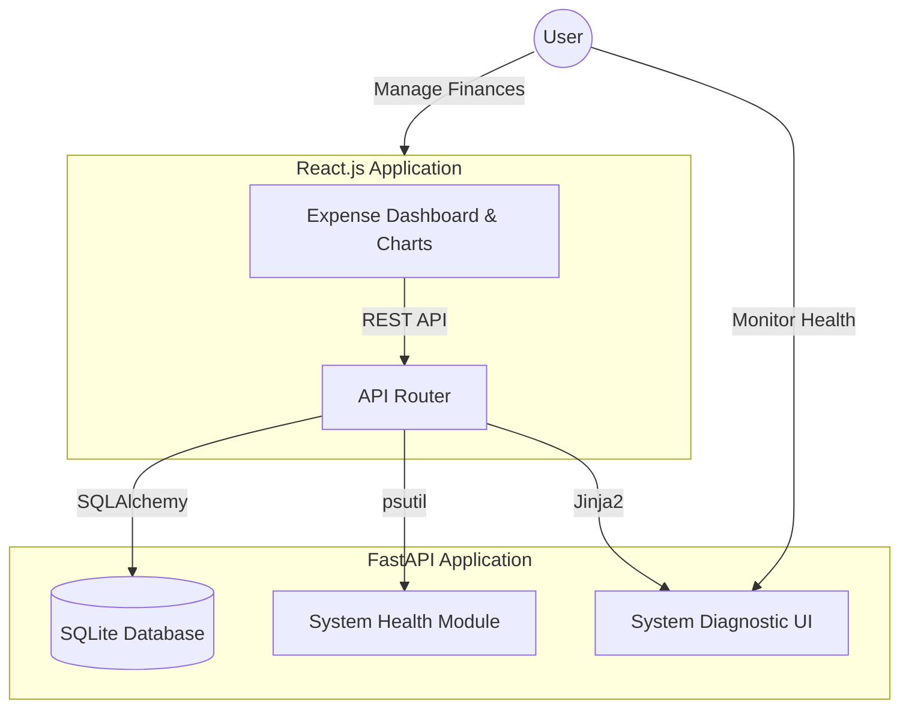

# Expense Tracker

A full-stack Expense Tracker application with an integrated real-time system health monitoring module. Built to manage personal finances securely while simultaneously providing deep insights into application and system health.

## 🌟 Key Features

- **Financial Management:** Manage income, expenses, and category-wise monthly budgets through an intuitive React.js user interface.
- **Robust Backend:** Designed a normalized relational database schema with RESTful APIs using FastAPI, SQLAlchemy ORM, and Pydantic schemas for strict data modeling and validation.
- **Secure Authentication & Analytics:** 
  - JWT-based authorization with bcrypt password hashing.
  - Interactive pie-chart analytics to visualize spending patterns and category-wise financial insights.
- **System Health Monitoring:** 
  - Integrated `psutil` to track real-time CPU, memory, disk, network usage, uptime, and top processes.
  - Features health indicators and diagnostic reporting for continuous application and system monitoring.

## 🏗️ Architecture Diagram



## 🛠️ Tech Stack

**Python | React.js | FastAPI | SQLAlchemy | SQLite | psutil**

## 🚀 Getting Started

### 1. Backend Setup (FastAPI & psutil)

```bash
cd backend
python -m venv venv
# Windows: venv\Scripts\activate
# Mac/Linux: source venv/bin/activate
pip install -r requirements.txt
uvicorn main:app --reload --port 8000
```
- API Docs & Swagger UI: `http://localhost:8000/docs`
- **System Health Monitor:** `http://localhost:8000/system-monitor`

### 2. Frontend Setup (React.js)

Open a new terminal:
```bash
cd frontend
npm install
npm run dev
```
- App UI: `http://localhost:5173`

## 👨‍💻 Project Structure

- `backend/` - Contains the FastAPI application, SQLite database models, auth logic, and the `monitor.py` script for real-time system metrics.
- `frontend/` - Contains the React.js application with interactive charts and budget management.

## 📄 License
This project is open-source and available under the MIT License.
 
